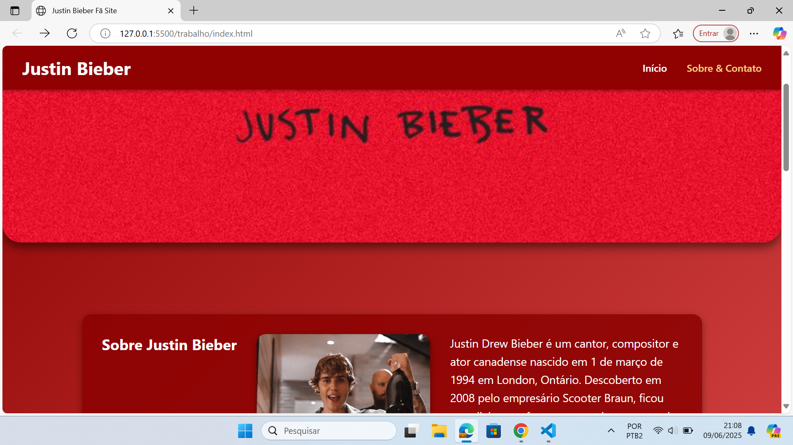

# Site Flexbox - Matheus Mattos

## 🎤 Tema: Justin Bieber

Este é um site responsivo criado como parte de um projeto de desenvolvimento web utilizando HTML5 e CSS3 com Flexbox. O tema escolhido foi o cantor canadense **Justin Bieber**, com foco em sua carreira, discografia e curiosidades.

---

## 📄 Páginas Criadas

### 1. `index.html` – Página Inicial  
- Banner com imagem do artista  
- Biografia detalhada com curiosidades  
- Sessão de álbuns com links para páginas individuais

### 2. `contato.html` – Sobre & Contato  
- Informações complementares sobre o artista  
- Formulário de contato  
- Links para redes sociais

### 3. Páginas dos Álbuns (ex: `purpose.html`, `justice.html`, etc.)  
- Cada álbum possui sua própria página com lista de faixas  
- Layout padronizado com cabeçalho fixo e estilo responsivo

---

## 🎨 Tecnologias Utilizadas

- **HTML5**
- **CSS3**
  - Flexbox para o layout e alinhamento
- Sem uso de frameworks ou bibliotecas externas

---

## 🖼️ Estilo Visual

O site utiliza uma paleta de cores baseada no banner principal, com tons de **vermelho escuro**, **dourado suave** e **branco**, criando um visual moderno e elegante. O layout é 100% responsivo, adaptando-se a celulares, tablets e desktops.

---

## 💻 Como visualizar

1. Clone ou baixe este repositório
2. Abra o arquivo `index.html` no navegador
3. Navegue pelas páginas pelo menu fixo no topo

---
## 📸 Imagem de Exemplo

